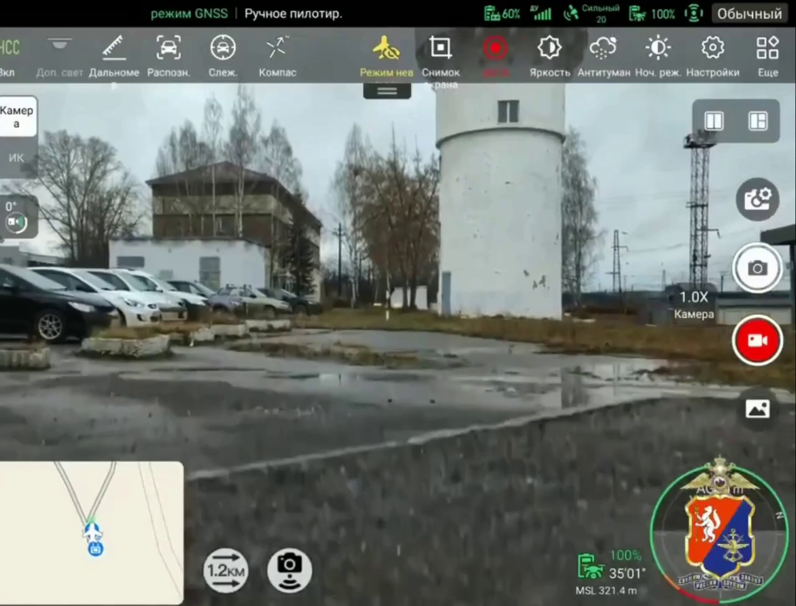
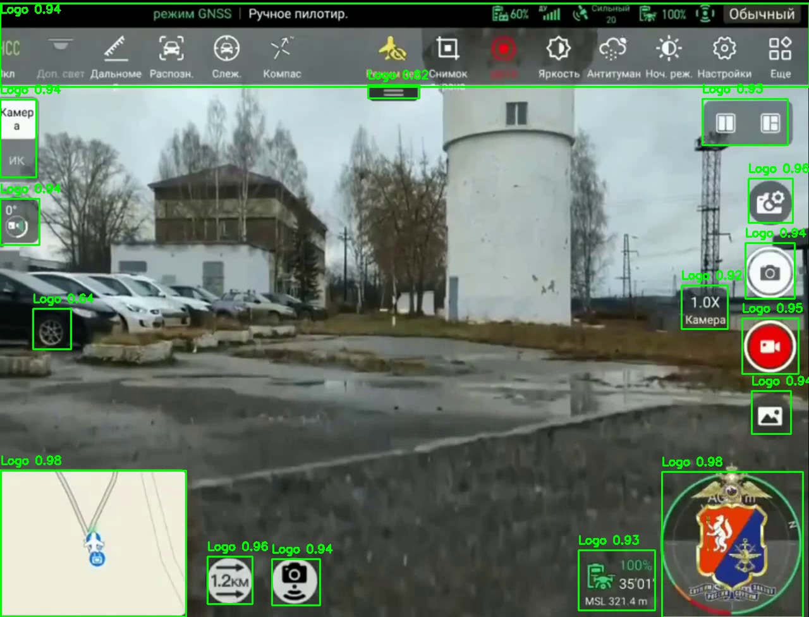
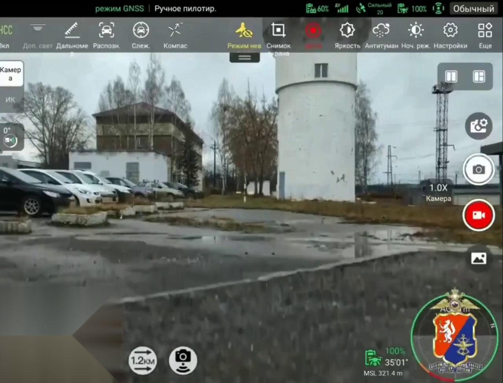

# Video Watermark & Service Overlay Remover

[](https://www.python.org/)
[](https://github.com/ultralytics/ultralytics)
[](https://opencv.org/)
[](https://opensource.org/licenses/MIT)

An automated AI-powered tool built with **YOLOv8** and **OpenCV** designed to detect, track, and seamlessly remove service information, TV station logos, watermarks, timestamps, and on-screen overlays from video files.

---

## 🖼️ Before & After Showcase

The project employs a two-stage computer vision pipeline: first locating overlays with high-precision deep learning, then reconstructing the background using texture synthesis.

| 1. Original Frame | 2. YOLOv8 Detection | 3. Inpainted (Telea Mode) | 4. Gaussian Blur Mode |
| :---: | :---: | :---: | :---: |
|  |  |  |  |
| *Raw video with station watermark/logo* | *Frame-by-frame bounding box (`conf: 0.98`)* | *Seamless background reconstruction* | *Privacy obfuscation mode* |

---

## 📌 Overview & Architecture

Removing hardcoded graphic elements (channel badges, ticker bars, timestamps, camera HUDs) from videos requires both accurate detection and artifact-free pixel reconstruction. 

This project implements a **two-stage, decoupled architecture**:

```
 [Input Video (input/video.mp4)]
               │
               ▼  Stage 1: detect_to_json.py (YOLOv8)
 [output/annotations.json]  ──►  (Optional: output/marked_video.mp4)
               │
               ▼  Stage 2: remove_from_json.py (OpenCV)
 [Clean Output Video (output/removed_video.mp4)]
```

### 💡 Why a Two-Stage (JSON-First) Pipeline?
1. **Separation of Compute**: Heavy GPU/neural inference runs only once during the detection phase.
2. **Human-in-the-Loop Verification**: The resulting `annotations.json` file is human-readable. You can inspect or edit coordinates to eliminate false positives before rendering the final video.
3. **Instant Parameter Tuning**: Experiment with different removal modes (`inpaint`, `blur`, `black`) and border padding sizes (`--padding`) in seconds without having to rerun the neural network.

---

## ✨ Key Features

- 🎯 **High Accuracy Detection**: Powered by a custom-trained **YOLOv8** model (`best.pt`) optimized for finding service graphics and watermarks.
- 🎨 **3 Removal Algorithms**:
  - `inpaint` *(Recommended)*: Alexandru Telea's Fast Marching Method (`cv2.INPAINT_TELEA`) reconstructs smooth textures from surrounding pixels.
  - `blur`: High-intensity Gaussian blur ($51 \times 51$ kernel) for blurring private info.
  - `black`: Solid blackout masking rectangle.
- 📐 **Adaptive Padding**: Expand bounding boxes symmetrically by $N$ pixels (`--padding`) to eliminate anti-aliased halos, gradients, and shadows around logos.
- 🔍 **Granular Filtering**: Filter detections by minimum confidence threshold (`--conf`, `--min-conf`) and specific class IDs (`--classes`).
- ⚡ **Windows 1-Click Automation**: Includes ready-to-run `.bat` scripts for automated workflows.
- 🔬 **Extensible Foundation**: Prepared integration with deep neural inpainting models (**LaMa — Large Mask Inpainting**).

---

## 📁 Project Structure

```text
├── best.pt                 # Trained YOLOv8 weights for overlay/watermark detection
├── detect_to_json.py       # Stage 1: runs YOLOv8 detection and exports JSON annotations
├── remove_from_json.py     # Stage 2: removes detected objects according to JSON data
├── inpaint_choice.py       # Experimental module supporting OpenCV vs. LaMa inpainting
├── run_detect_json.bat     # Windows batch script for Stage 1 (Detection)
├── run_remove_json.bat     # Windows batch script for Stage 2 (Removal)
├── run_inpaint.bat         # Interactive Windows CLI launcher
├── requirements.txt        # Python package dependencies
├── .gitignore              # Git ignore rules for virtualenvs, media, and checkpoints
├── docs/                   # Documentation assets and preview frames
│   ├── 1_original.jpg
│   ├── 2_detected.jpg
│   ├── 3_removed_inpaint.jpg
│   └── 4_removed_blur.jpg
├── input/                  # Directory for source video files (e.g. video.mp4)
├── output/                 # Directory for output files (annotations.json, videos)
├── lama/                   # Submodule / repository for LaMa neural inpainting
└── runs/                   # Checkpoints, validation metrics, and training logs
```

---

## 📦 Installation & Setup

### 1. Prerequisites
- **Operating System**: Windows 10/11, Linux, or macOS
- **Python**: `3.10` or `3.11` (recommended for optimal PyTorch and CUDA stability)
- **Hardware**: An NVIDIA GPU with CUDA support is recommended for fast video processing, though the pipeline runs on CPU as well.

---

### 2. Clone the Repository
```bash
git clone https://github.com/username/video-service-info-remover.git
cd video-service-info-remover
```

---

### 3. Create a Virtual Environment
Creating an isolated environment avoids dependency conflicts with system packages:

* **On Windows (using Python Launcher):**
  ```bash
  py -3.10 -m venv venv
  ```
  *(or `python -m venv venv` if Python 3.10 is your system default)*

* **On Linux / macOS:**
  ```bash
  python3 -m venv venv
  ```

---

### 4. Activate the Virtual Environment

* **Windows PowerShell:**
  ```powershell
  .\venv\Scripts\Activate.ps1
  ```
  *(Note: If you receive an execution policy restriction error, run `Set-ExecutionPolicy -Scope Process -ExecutionPolicy Bypass` once, then activate again)*

* **Windows Command Prompt (CMD):**
  ```cmd
  venv\Scripts\activate.bat
  ```

* **Linux / macOS:**
  ```bash
  source venv/bin/activate
  ```

---

### 5. Install PyTorch

Install PyTorch according to your available hardware:

* **With NVIDIA GPU (CUDA 11.8 / 12.x acceleration):**
  ```bash
  pip install torch torchvision --index-url https://download.pytorch.org/whl/cu118
  ```

* **CPU-only (no discrete NVIDIA GPU):**
  ```bash
  pip install torch torchvision
  ```

---

### 6. Install Project Dependencies
Install all remaining required libraries:
```bash
pip install -r requirements.txt
```

---

### 7. Verify Installation
Run this one-liner to verify that all core components are available:
```bash
python -c "import torch, cv2, ultralytics; print('PyTorch:', torch.__version__, '| CUDA available:', torch.cuda.is_available(), '| Ultralytics:', ultralytics.__version__)"
```
If the libraries report their versions without errors, your setup is complete and ready.

---

## 🚀 How to Use

### Method 1: Quick Start with Windows Batch Files (.bat)

1. Place your target video in the `input/` folder and name it `video.mp4` (or update the path inside the `.bat` files).
2. Double-click **`run_detect_json.bat`**:
   - Runs YOLOv8 over the video.
   - Generates `output/annotations.json` (bounding boxes) and `output/marked_video.mp4` (visual preview with boxes).
3. Double-click **`run_remove_json.bat`**:
   - Reads the annotations and cleans the video using Inpaint mode with 10px padding.
   - Saves the final video to `output/removed_video.mp4`.

---

### Method 2: Command Line Interface (CLI)

#### Step 1: Object Detection (`detect_to_json.py`)

Run the detector to locate watermarks/logos and export their bounding boxes:

```bash
python detect_to_json.py ^
  --model best.pt ^
  --input input/video.mp4 ^
  --json output/annotations.json ^
  --output-video output/marked_video.mp4 ^
  --conf 0.25
```

**Options:**
| Flag | Required | Default | Description |
| :--- | :---: | :---: | :--- |
| `--model` | **Yes** | — | Path to the trained YOLO model (`best.pt`). |
| `--input` | **Yes** | — | Path to the input video file. |
| `--json` | No | `output/annotations.json` | Path where JSON annotations will be saved. |
| `--output-video` | No | `None` | Path to save an optional preview video with rendered bounding boxes. |
| `--conf` | No | `0.25` | Confidence detection threshold (`0.0` to `1.0`). Lower to catch faint logos; raise to suppress false positives. |
| `--classes` | No | `None` | Comma-separated class IDs to track (e.g. `0` or `0,1`). If omitted, all classes are exported. |

---

#### Step 2: Object Removal (`remove_from_json.py`)

Process the video and remove or mask the detected areas:

```bash
python remove_from_json.py ^
  --input input/video.mp4 ^
  --json output/annotations.json ^
  --output output/removed_video.mp4 ^
  --mode inpaint ^
  --padding 10 ^
  --min-conf 0.25
```

**Options:**
| Flag | Required | Default | Description |
| :--- | :---: | :---: | :--- |
| `--input` | **Yes** | — | Path to the input video file. |
| `--json` | **Yes** | — | Path to the JSON annotations file from Step 1. |
| `--output` | No | `output/removed_video.mp4` | Path for the processed output video. |
| `--mode` | No | `inpaint` | Removal method: `inpaint` (Telea texture reconstruction), `blur` (Gaussian blur), or `black` (blackout mask). |
| `--padding` | No | `10` | Number of pixels to expand the bounding box outwards in all directions. Helps remove edge halos and soft shadows. |
| `--min-conf` | No | `0.0` | Minimum confidence required to remove a detection from the JSON. |
| `--classes` | No | `None` | Comma-separated class IDs to remove. If omitted, all detected classes are processed. |

---

## 📊 JSON Annotation Schema

The exported `output/annotations.json` file contains structured metadata for each frame:

```json
{
  "video": {
    "path": "input/video.mp4",
    "fps": 29.97,
    "width": 1280,
    "height": 976,
    "total_frames": 2088
  },
  "model": {
    "path": "best.pt",
    "names": {
      "0": "Logo"
    }
  },
  "frames": [
    {
      "frame_index": 0,
      "time_sec": 0.0,
      "objects": [
        {
          "class_id": 0,
          "class_name": "Logo",
          "confidence": 0.9806,
          "bbox": {
            "x1": 1,
            "y1": 746,
            "x2": 293,
            "y2": 975
          }
        }
      ]
    }
  ]
}
```

---

## 🔬 Experimental Roadmap: Deep Neural Inpainting (LaMa)

The project includes the repository for **Large Mask Inpainting (LaMa)** by Samsung AI Center under `lama/`. While OpenCV's Telea algorithm works fast for small-to-medium watermarks, deep learning inpainting can synthesize complex backgrounds across larger masked regions. An experimental pipeline switcher is provided in `inpaint_choice.py`.

---

## 📄 License

This project is licensed under the [MIT License](LICENSE).
